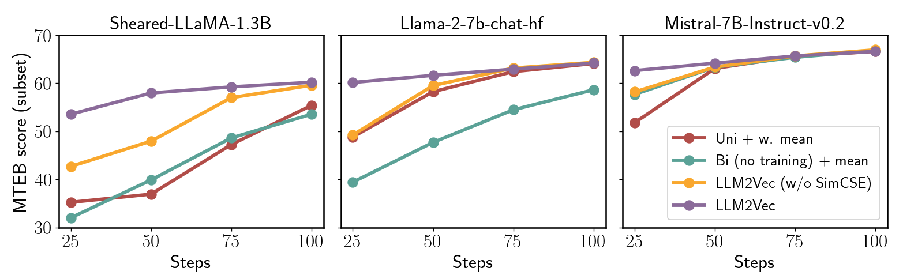

# LLM2Vec: Large Language Models Are Secretly Powerful Text Encoders

*Authors: X, Y, Z*

Some general intro why text embedding models are important.

Some general intro about why we want to use decoder-only LLMs for text emebddings. 

Our new work, [LLM2Vec: Large Language Models Are Secretly Powerful Text Encoders](link) introduces ...

Our hands-on tutorial walks you through the steps of transforming a decoder-only LLM into a powerful text encoder.

## A simple and efficient recipe

At its core, LLM2Vec consists of three simple steps: 1) enabeling bidirectional attention, 2) adaptation via masked next token prediction (MNTP), and 3) adaptation via unsupervised contrastive learning.

Adapting a model with the LLM2Vec approach is highly parameter-efficient and works with parameter-efficient fine-tuning methods such as LoRA. Additionally, the adaptation can be performed using a general domain corpus such as Wikipedia, and requires only a few hundred training steps.


## State-of-the-art performance

LLM2Vec is not only simple and efficient, it also leads to state-of-the-art performance on the challenging Massive Text Embeddings benchmark (MTEB), among the models that train only on publicly available data.  

### Unsupervised results

We apply LLM2Vec to some of the best performing LLMs available and evaluate the resulting text embedding models on MTEB. In the unsupervised setting, i.e., without using any labeled training data for contrastive learning, our LLM2Vec transformed models achieve a new state-of-the-art performance of $0.0$, outperforming previous unsupervised approach by a large margin.


### Supervised results

Text goes here


## Highly sample-efficient

LLM2Vec transformed models not only achieve state-of-the-art performance, they also need to see less data to perform well when compared to training models without the LLM2vec transformation.



These results make us particularly excited about challenging real-world scenarios where large amounts of labeled data might be costly to aquire.

## Use it on your own data

We have made it very easy for you to use our LLM2Vec transformed models. The example code snipped below shows how to ...

```
1. code goes here # comment
2. code goes here # comment
```

To learn how to apply LLM2Vec to your own models, take a look at our tutorial which walks you through an example.

----

Research: [text](link)

Code: [text](link)

Tutorial: [text](link)